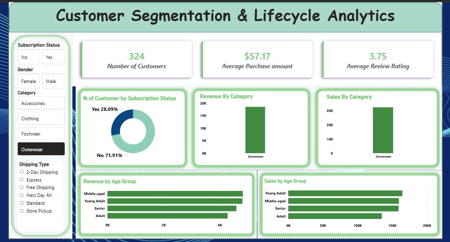

# Customer Segmentation & Lifecycle Analytics

## 📘 Overview

This project demonstrates a complete **data analytics workflow** — from data loading and cleaning to visualization and presentation. It showcases practical experience in Python, MySQL, Power BI, and Gamma for transforming raw data into actionable insights.

---

## 📊 Dataset

* **Source:** Public dataset (https://www.kaggle.com/datasets/zeesolver/consumer-behavior-and-shopping-habits-dataset)
* **Description:** Contains demographic, purchase, and behavioral information used to analyze customer trends and performance.
* **Format:** CSV file loaded into Python for preprocessing and later stored in MySQL for query execution.

---

## 🛠 Tools & Technologies

* **Python** – for loading, cleaning, and analyzing data (Pandas, NumPy, Matplotlib, Seaborn)
* **MySQL** – for writing and running SQL queries, joins, and aggregations
* **Power BI** – for building an interactive dashboard
* **Gamma** – for creating an automated PPT report
* **Jupyter Notebook / VS Code** – for Python scripting

---

## ⚙️ Steps / Workflow

1. **Data Loading:** Imported dataset into Python using Pandas.
2. **Data Cleaning:** Handled missing values, duplicates, and data type inconsistencies.
3. **Exploratory Data Analysis (EDA):**

   * Analyzed key statistics and relationships.
   * Visualized patterns and correlations using Python libraries.
4. **Database Integration:**

   * Loaded cleaned data into **MySQL**.
   * Executed SQL queries for segmentation, trend, and performance analysis.
5. **Dashboard Creation:**

   * Built a **Power BI dashboard** showing KPIs, category insights, and purchase trends.
6. **Reporting:**

   * Used **Gamma** to automatically create a presentation summarizing key findings.

---

## 📈 Dashboard Highlights

* Total Revenue and Customer Overview
* Purchase Trends by Age Group and Subscription Status
* Product Category Insights
* Customer Retention and Loyalty Metrics

---

## 🧾 Results & Insights

* Identified top-performing customer segments and products.
* Observed purchase behavior variations across age groups.
* Provided recommendations for customer retention and sales improvement.

---

## ▶️ How to Run

1. Clone the repository or download project files.
2. Set up Python environment and install dependencies (`pip install -r requirements.txt`).
3. Import the dataset and run the Jupyter Notebook for data cleaning and EDA.
4. Import cleaned data into **MySQL** and execute SQL scripts.
5. Open **Power BI** to connect to the MySQL database and refresh visuals.
6. Export report summary using **Gamma**.

---

## 📬 Contact

**Author:** Abhishek Raj
**Role:** Data Analyst | Power BI & SQL Enthusiast
**LinkedIn:** https://www.linkedin.com/in/abhishek-raj-b3ab32360/

